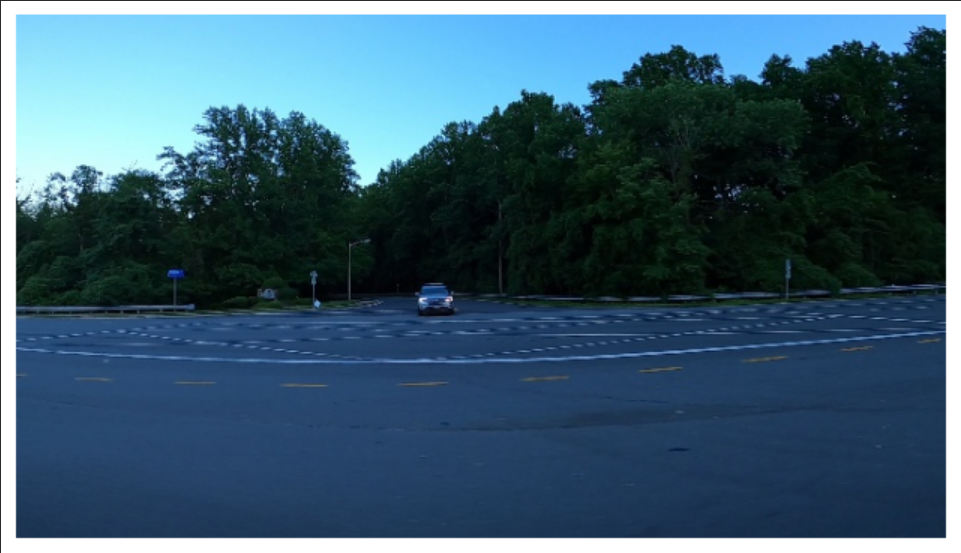
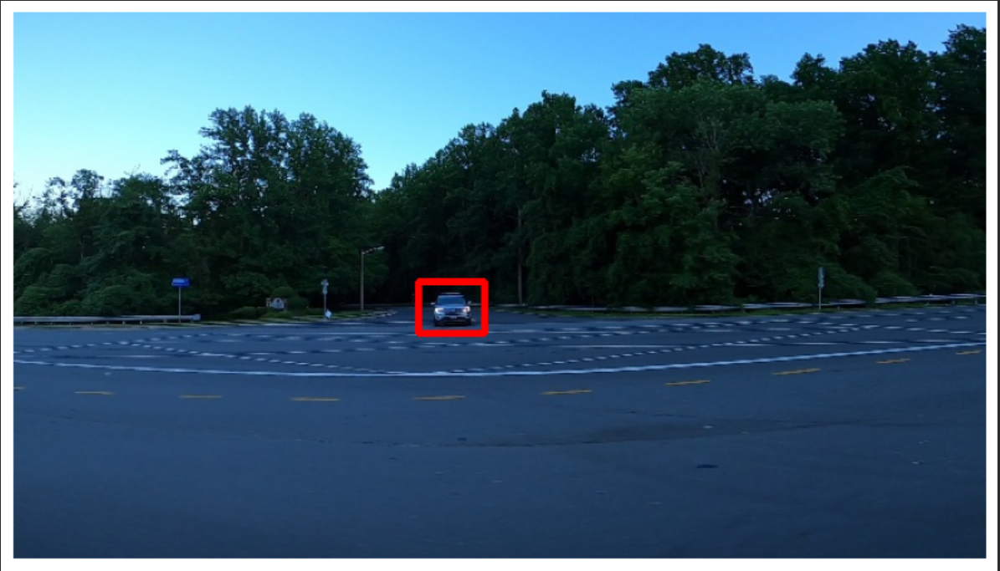

# Object Detection Using TensorFlow

## 📌 Overview

This project implements an **Object Detection system using TensorFlow and Python**. The project demonstrates the use of deep learning and computer vision techniques to process images and identify objects.

The implementation uses **TensorFlow, OpenCV, NumPy, Pandas, and Matplotlib** for model development, image processing, data handling, and visualization.

## 🎯 Objectives

* Develop a practical understanding of object detection.
* Process and prepare image data for detection.
* Apply TensorFlow for deep learning-based object detection.
* Use OpenCV for image processing.
* Visualize and analyze detection results.

## Dataset

The project uses image data for object detection. The input images are
provided during execution and are used for preprocessing and object
detection.

The dataset is not included in this repository due to file size.

## 🛠️ Technologies Used

| Technology   | Purpose                            |
| ------------ | ---------------------------------- |
| Python       | Programming language               |
| TensorFlow   | Deep learning and object detection |
| OpenCV       | Image processing                   |
| NumPy        | Numerical operations               |
| Pandas       | Data handling                      |
| Matplotlib   | Data and result visualization      |
| Google Colab | Development environment            |

## 🔄 Methodology

The project follows a basic object detection workflow:

1. Import the required libraries.
2. Load the required input data.
3. Preprocess the images.
4. Perform object detection using TensorFlow.
5. Analyze the detected objects.
6. Visualize the results.

## 📂 Repository Structure

```text
Object-Detection/
│
├── object_detection.ipynb
├── README.md
├── requirements.txt
└── .gitignore
```

## 🚀 Getting Started

### Prerequisites

Make sure Python is installed on your system, or use **Google Colab** to run the notebook.

### Installation

Install the required dependencies:

```bash
pip install tensorflow pandas numpy opencv-python matplotlib
```

### Running the Project

1. Clone this repository.
2. Open `object_detection.ipynb`.
3. Run the notebook in Google Colab or Jupyter Notebook.
4. Provide the required input images when prompted.
5. Execute the cells sequentially.
6. Observe and analyze the object detection results.

## 📊 Results

The object detection model was tested on a sample road image. The original
image is processed and the detected vehicle is highlighted using a bounding box.

### Original Image



### Detection Result



## 📚 Learning Outcomes

Through this project, I gained practical experience in:

* TensorFlow and deep learning workflows
* Computer vision and image processing
* Working with image-based data
* Python libraries used in machine learning
* Visualizing machine learning results
* Developing and documenting a machine learning project

## 🔮 Future Improvements

The project can be further enhanced by:

* Using a larger and more diverse dataset.
* Improving detection accuracy.
* Implementing real-time object detection using a camera.
* Exploring advanced object detection architectures.
* Deploying the model as a web or mobile application.

## 👨‍💻 Author

**Gade Vishwesh**

Student | Machine Learning & Computer Vision Enthusiast
